# Local AI Stack

A self-hosted, GPU-accelerated AI stack built on Docker. Local LLMs handle initial
drafts via Ollama; Claude (via LiteLLM gateway) provides final review and improvement.
All services are accessible through a single nginx reverse proxy on port 80.

---

## Prerequisites

- **Docker Desktop** (Windows) with the **WSL2 backend** enabled
- **NVIDIA Container Toolkit** — for GPU passthrough to Ollama, Stable Diffusion, TTS
- A `.env` file in this directory (copy `.env.example` or see [Environment Setup](#environment-setup))
- An **Anthropic API key** for the Claude review pipelines

---

## Quick Start

```bash
# Start the core stack
docker compose up -d

# Start with optional services
docker compose --profile automation up -d        # + n8n
docker compose --profile image up -d             # + Stable Diffusion
docker compose --profile automation --profile image up -d  # + both

# Stop everything (data is preserved)
docker compose down

# Restart a single service (e.g. after editing a pipeline)
docker compose restart pipelines

# Pull a new Ollama model
docker exec -it ollama ollama pull qwen2.5-coder:14b

# View logs for a service
docker compose logs -f pipelines
docker compose logs -f litellm
```

---

## Service URLs

| Service | Nginx path | Direct port |
|---------|-----------|-------------|
| **Open-WebUI** | `http://localhost/` | `localhost:8081` |
| **LiteLLM** | `http://localhost/litellm/` | `localhost:4000` |
| **Pipelines** | `http://localhost/pipelines/` | `localhost:9099` |
| **Ollama** | `http://localhost/ollama/` | `localhost:11434` |
| **ChromaDB** | `http://localhost/chroma/` | `localhost:8000` |
| **SearXNG** | `http://localhost/search/` | `localhost:8080` |
| **n8n** *(optional)* | `http://localhost/n8n` → redirect | `localhost:5678` |
| **Stable Diffusion** *(optional)* | `http://localhost/sd/` | `localhost:7860` |

> **n8n note:** The nginx path redirects to `localhost:5678` because n8n's webpack build
> uses root-relative asset paths that break subpath proxying. Use the direct port.

> **SD note:** Stable Diffusion is a profile service (`--profile image`). Use the direct
> port `:7860` for the full UI; the `/sd/` nginx path may have broken assets.

---

## Pipelines (Local LLM → Claude)

Pipelines appear as selectable models in Open-WebUI. Each runs a two-stage flow:
a local Ollama model drafts a response, then Claude reviews and improves it.

Select a pipeline from the **model selector** in Open-WebUI (top of the chat window).

| Pipeline | Stage 1 (Local) | Stage 2 (Claude) | Best for |
|----------|----------------|------------------|----------|
| **AI Code Review** | `qwen2.5-coder:14b` | `claude-sonnet` | Code generation, debugging, architecture |
| **AI Reasoning Review** | `deepseek-r1:14b` | `claude-sonnet` | Analysis, planning, research |
| **AI Chat Assist** | `llama3.1:8b` | `claude-haiku` | General Q&A, writing, conversation |

### Configuring a Pipeline

1. Go to **Admin Panel → Pipelines** in Open-WebUI
2. Click the gear icon next to a pipeline to open **Valves**
3. Adjustable settings per pipeline:
   - `LOCAL_MODEL` — which Ollama model to use for stage 1
   - `CLAUDE_MODEL` — `claude-sonnet` or `claude-opus` (via LiteLLM alias)
   - `SKIP_LOCAL` — set to `"true"` to skip local draft and call Claude directly
   - `REVIEW_SYSTEM` — customize Claude's review instructions

---

## Available Models

### Local (Ollama)

Pull models with `docker exec -it ollama ollama pull <model>`:

| Model | Tag | VRAM | Purpose |
|-------|-----|------|---------|
| qwen2.5-coder | `14b` | ~10 GB | Code generation (recommended) |
| qwen2.5-coder | `32b-instruct-q4_K_M` | ~20 GB | Exceeds 16 GB card — use partial offload |
| deepseek-r1 | `14b` | ~10 GB | Reasoning / chain-of-thought |
| llama3.1 | `8b` | ~6 GB | Fast conversational |
| qwen2.5vl | `7b` | ~6 GB | Vision (image understanding) |

### Cloud (via LiteLLM — requires API keys in `.env`)

| Alias | Model | Provider |
|-------|-------|----------|
| `claude-opus` | claude-opus-4-6 | Anthropic |
| `claude-sonnet` | claude-sonnet-4-6 | Anthropic |
| `claude-haiku` | claude-haiku-4-5-20251001 | Anthropic |
| `gpt-4o` | gpt-4o | OpenAI |
| `groq-fast` | llama-3.3-70b | Groq |
| `gemini-flash` | gemini-2.0-flash | Google |

### GPU Tuning

Ollama GPU behaviour is configured via `.env`:

| Variable | Default | Effect |
|----------|---------|--------|
| `OLLAMA_GPU_OVERHEAD` | `536870912` (512 MB) | VRAM reserved as headroom — prevents OOM |
| `OLLAMA_KEEP_ALIVE` | `5m` | Unload model after idle — frees VRAM between sessions |
| `OLLAMA_MAX_LOADED_MODELS` | `1` | Max simultaneous models in VRAM |

**Partial GPU offload for the 32b model** — Ollama doesn't have a global layer-count env var;
set it per model:

- **Open-WebUI:** Admin Panel → Models → edit model → Advanced → `num_gpu = 40`
  (64 layers total; 40 on GPU fits the 32b model within 16 GB, remainder on CPU)
- **Modelfile (persistent):**
  ```
  FROM qwen2.5-coder:32b-instruct-q4_K_M
  PARAMETER num_gpu 40
  ```
  then `ollama create qwen32b-partial -f Modelfile`

---

## clod — Local AI CLI

`clod.exe` (Windows) is a terminal CLI that talks directly to the local AI stack.
It mirrors the Claude CLI experience but routes through Ollama and the pipelines service.

### Usage

```powershell
# Interactive REPL (default model: qwen2.5-coder:14b)
.\clod.exe

# One-shot prompt
.\clod.exe -p "explain this error: ..."

# Use a pipeline
.\clod.exe --pipeline code_review

# Enable tool use (bash, file read/write, web search)
.\clod.exe --tools

# Index a directory — generate CLAUDE.md + README.md for each project found
.\clod.exe --index C:\projects
```

### REPL Commands

| Command | Description |
|---------|-------------|
| `/model <name>` | Switch local model |
| `/pipeline <name\|off>` | Switch pipeline or disable |
| `/offline [on\|off]` | Toggle offline mode — local model only, no Claude calls |
| `/tokens` | Show session Claude token usage |
| `/tools [on\|off]` | Toggle tool use |
| `/index [path]` | Index projects under path |
| `/services [status\|start\|stop\|reset]` | Manage Docker services |
| `/clear` | Clear conversation history |
| `/save <file>` | Save conversation to JSON |

### MCP Filesystem Server

On startup clod asks whether to enable MCP filesystem access. If enabled, it starts
an HTTP server on `0.0.0.0:8765` that exposes the chosen directory to the LLM:

| Endpoint | Method | Action |
|----------|--------|--------|
| `/list` | GET | List files in workspace root |
| `/<path>` | GET | Read a file |
| `/<path>` | POST | Write a file (raw body) |
| `/<path>` | DELETE | Delete a file |

#### Connecting Open-WebUI to the MCP server

Two modes — configure via the tool's **Valves** in Open-WebUI:

**Mode A — Shared volume mount (fastest)**

1. Set `SHARED_DIR` in `.env` to any host path (e.g. `SHARED_DIR=C:/Users/you/projects`)
2. Restart Open-WebUI: `docker compose up -d open-webui`
3. In Open-WebUI: Workspace → Tools → `+` → paste `tools/clod_mcp_tool.py`
4. Set **Valves → `shared_dir`** = `/workspace`

The LLM reads/writes files directly from the mounted path — no HTTP round-trip.

**Mode B — HTTP via clod MCP**

1. Start clod, enable MCP, pick a directory
2. Leave **Valves → `shared_dir`** blank; `mcp_url` defaults to `http://host.docker.internal:8765`

### Token Budget & Offline Mode

`clod` tracks cumulative Claude API tokens per session against a configurable budget
(default: **100,000 tokens**, set `token_budget` in `%APPDATA%\clod\config.json`).

| Usage | Behaviour |
|-------|-----------|
| ≥ 80% | Yellow warning in header |
| ≥ 95% | Prompt: *"Budget at 95% — go offline? [y/n]"* |
| 100% | Automatically switches to offline mode |

**Offline mode** cuts all Claude/LiteLLM calls — only the local Ollama model is used.
Toggle with `/offline`, `/offline on`, `/offline off`.

### Project Indexer

`--index` / `/index` walks a directory tree, detects project roots (`.csproj`,
`package.json`, `Cargo.toml`, `Dockerfile`, etc.) and generates per-project:

- **`CLAUDE.md`** — AI-readable context: overview, key files, build commands, architecture
- **`README.md`** — Human-readable: description, tech stack, quick-start

### Config

`%APPDATA%\clod\config.json` (created automatically with defaults):

```json
{
  "ollama_url":    "http://localhost:11434",
  "litellm_url":   "http://localhost:4000",
  "litellm_key":   "sk-local-dev",
  "pipelines_url": "http://localhost:9099",
  "chroma_url":    "http://localhost:8000",
  "searxng_url":   "http://localhost:8080",
  "default_model": "qwen2.5-coder:14b",
  "token_budget":  100000
}
```

---

## Code Interpreter (Open-WebUI)

Open-WebUI has a built-in Pyodide-based Python sandbox — no extra containers needed.

- **Per-chat:** click the `</>` button in the message input bar
- **Global default:** Admin Panel → Settings → Code Execution → Enable Code Execution

Runs Python client-side via WebAssembly. Good for data manipulation, matplotlib charts,
quick calculations. For server-side execution with full library access, a Jupyter container
can be added to the stack and configured at Admin Panel → Settings → Code Execution → Jupyter.

> **Note:** The code interpreter adds tokens to the system prompt. Avoid using it with
> models larger than available VRAM (e.g. 32b on a 16 GB card) as generation will hang.

---

## Environment Setup

Copy `.env.example` to `.env` and fill in:

```bash
# Required for cloud models
ANTHROPIC_API_KEY=sk-ant-...

# Optional cloud providers
OPENAI_API_KEY=sk-...
GROQ_API_KEY=gsk_...
GEMINI_API_KEY=...

# Internal auth key — any secret string
LITELLM_MASTER_KEY=sk-local-dev

# Ports (defaults shown)
OPEN_WEBUI_PORT=8081

# Data storage root
BASE_DIR=${USERPROFILE}/docker-dependencies

# Shared workspace for Open-WebUI MCP tool (optional)
# SHARED_DIR=C:/Users/you/projects

# GPU tuning (optional)
# OLLAMA_GPU_OVERHEAD=536870912
# OLLAMA_KEEP_ALIVE=5m
# OLLAMA_MAX_LOADED_MODELS=1
```

---

## Network Architecture

```
[internet]
    ↑
  litellm:4000  (gateway network → Anthropic, OpenAI, Groq, etc.)
    ↑
[internal network — bridge, internal: true]
  litellm ←→ pipelines ←→ ollama:11434
  litellm ←→ chroma:8000
  litellm ←→ searxng:8080
  litellm ←→ n8n:5678

[gateway network — bridge]
  litellm, pipelines, chroma, n8n  (host port binding)

[default compose network]
  nginx:80 ←→ open-webui:8080

nginx is dual-homed (internal + default) — reverse proxies all services
```

Services on `internal`-only have no outbound internet access. Services also on `gateway`
have their ports published to the Windows host.

---

## Troubleshooting

**Pipelines or ChromaDB not detected by clod / ports not binding:**

Docker Desktop occasionally fails to bind ports at container creation. Recreate the affected containers:
```bash
docker compose up -d --force-recreate pipelines chroma
```

**Pipelines not showing in Open-WebUI model selector:**
```bash
docker compose restart pipelines
docker logs pipelines | grep -E "(Loaded|Error)"
```

**LiteLLM can't reach Ollama:**
```bash
docker exec litellm curl http://ollama:11434/api/tags
```

**Nginx not starting (host not found in upstream):**

Occurs when a profile service (e.g. Stable Diffusion) is listed as an upstream but not
running. The nginx config uses variable-based `proxy_pass` for SD to defer DNS resolution —
check `docker logs nginx` for the specific upstream that failed.

**Out of VRAM when running large models:**
```bash
# List loaded models and VRAM usage
docker exec -it ollama ollama ps
# Unload a model
docker exec -it ollama ollama stop qwen2.5-coder:32b-instruct-q4_K_M
```

**Reset a service's data volume:**
```bash
docker compose stop <service>
docker volume rm clod_<service>_data
docker compose up -d <service>
```

---

## Development

### Pre-commit Hooks

Two hook systems are available — install both for the best experience:

**1. `pre-commit` framework (black auto-format)**

Runs [black](https://black.readthedocs.io/) on every commit automatically.

```bash
pip install pre-commit
pre-commit install
```

Configured in `.pre-commit-config.yaml` — black at `--line-length=100` with Python 3.11.

**2. Custom `.githooks/pre-commit` (black + diff-size gate)**

A bash hook that formats staged `.py` files with black and re-stages them, then skips
review for diffs over 1000 lines to avoid excessive API cost.

```bash
git config core.hooksPath .githooks
```

> Both hooks run black on staged Python files. The `.githooks` hook applies
> formatting directly in the commit flow (auto-stages the formatted files),
> so you don't need to re-run `git add` manually.

---

## Screenshots

### Startup Banner

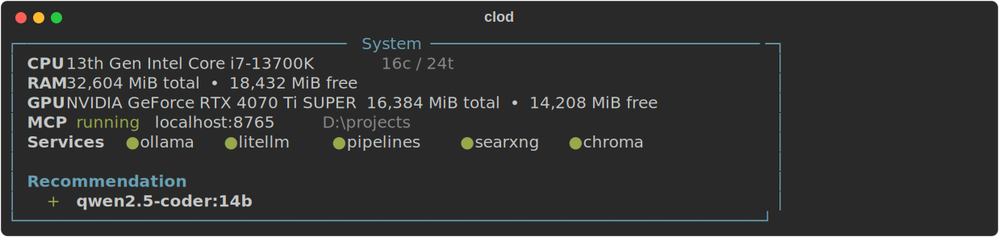

### Help

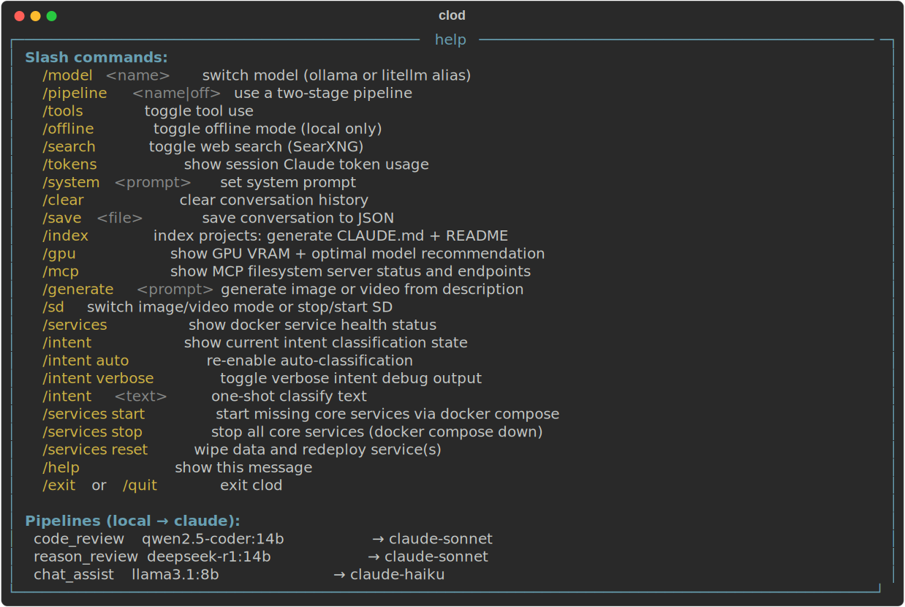

### Header — default

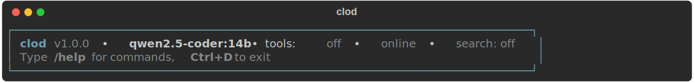

### Header — pipeline active

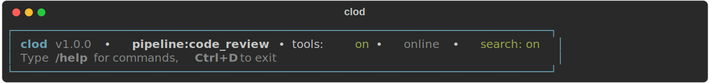

### Header — token budget warning (45%)

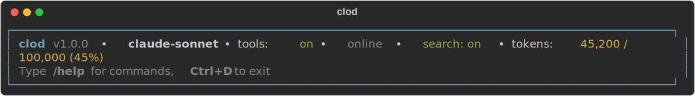

### Header — offline mode (86% used)

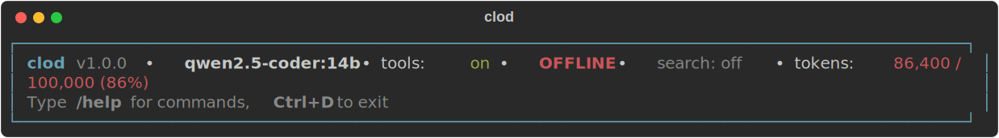

### Service Health

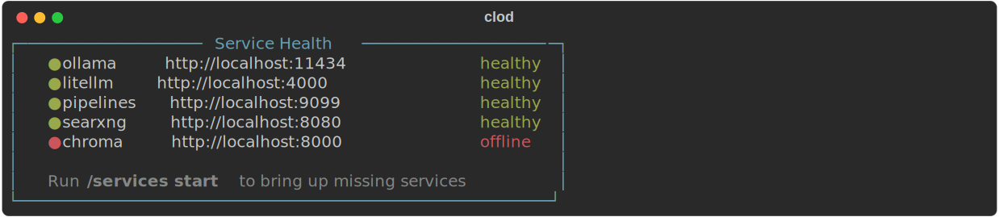

### Docker Startup

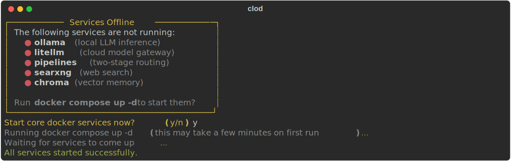

### GPU & VRAM

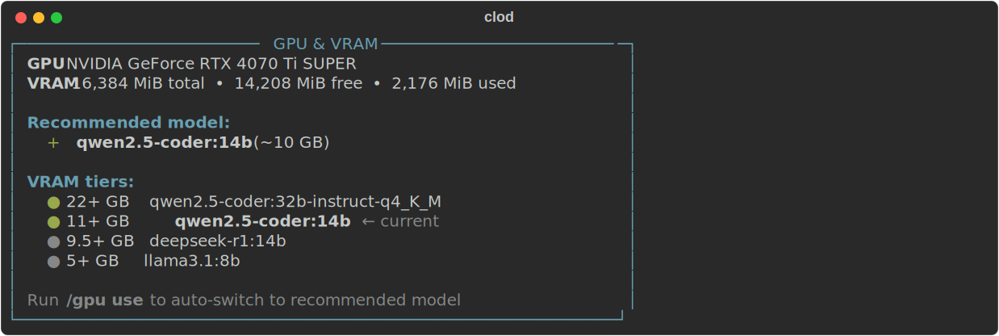

### Intent Classification

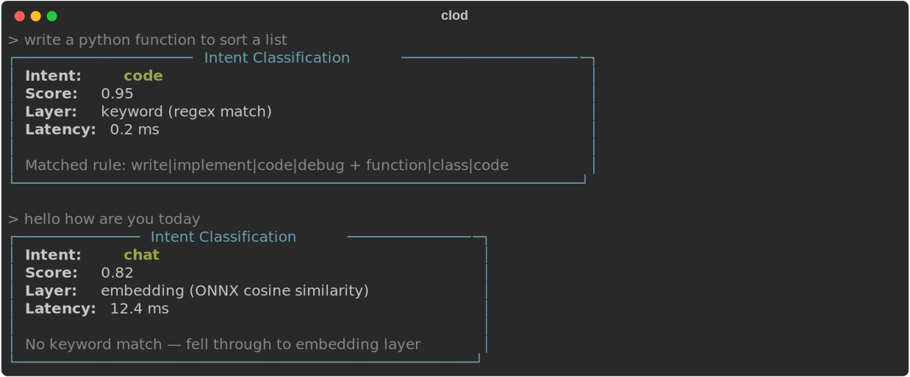

### Stable Diffusion Status

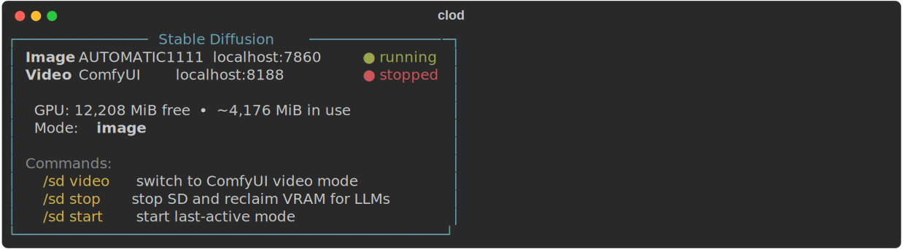

### Image Generation

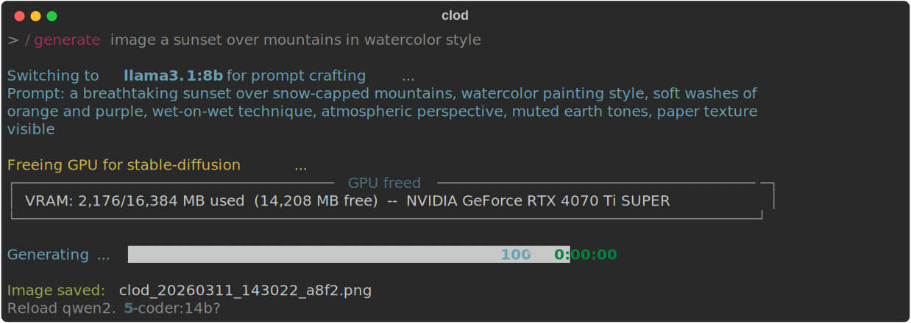

### Model Switching

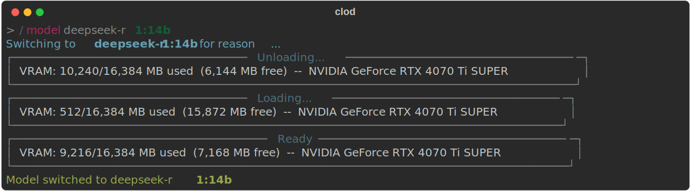

### Tool Use

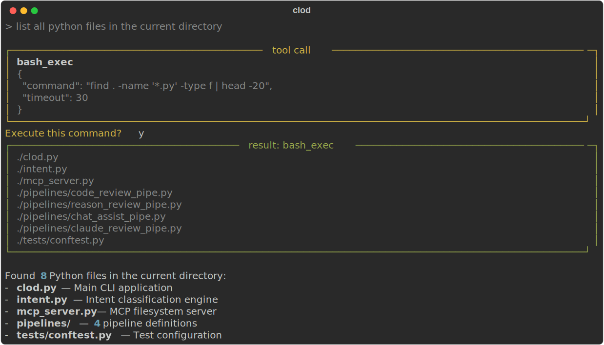

### Token Budget

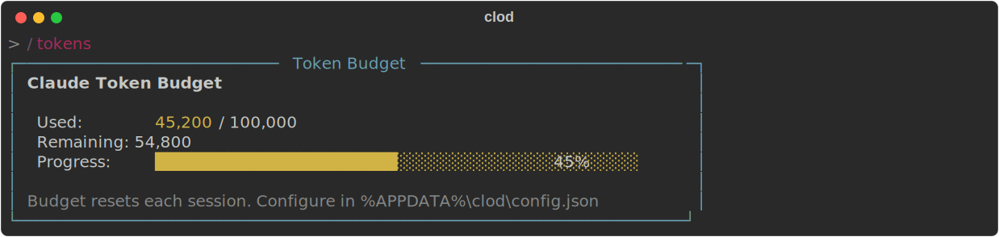
