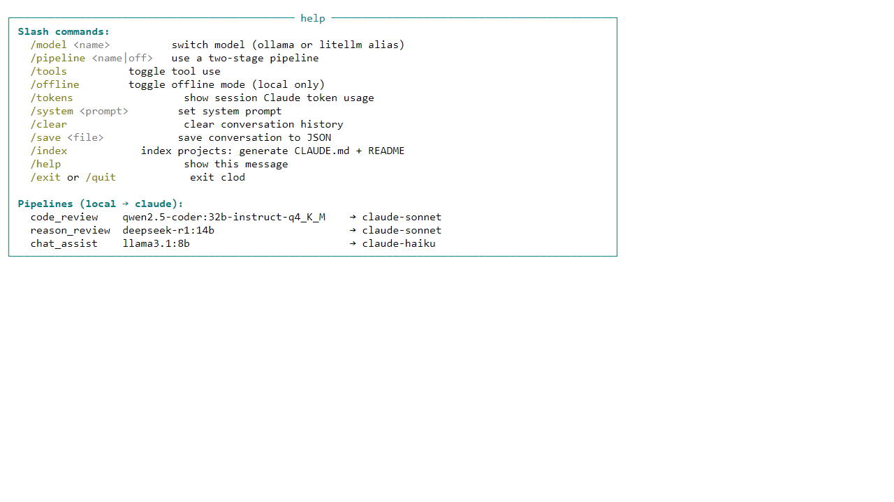
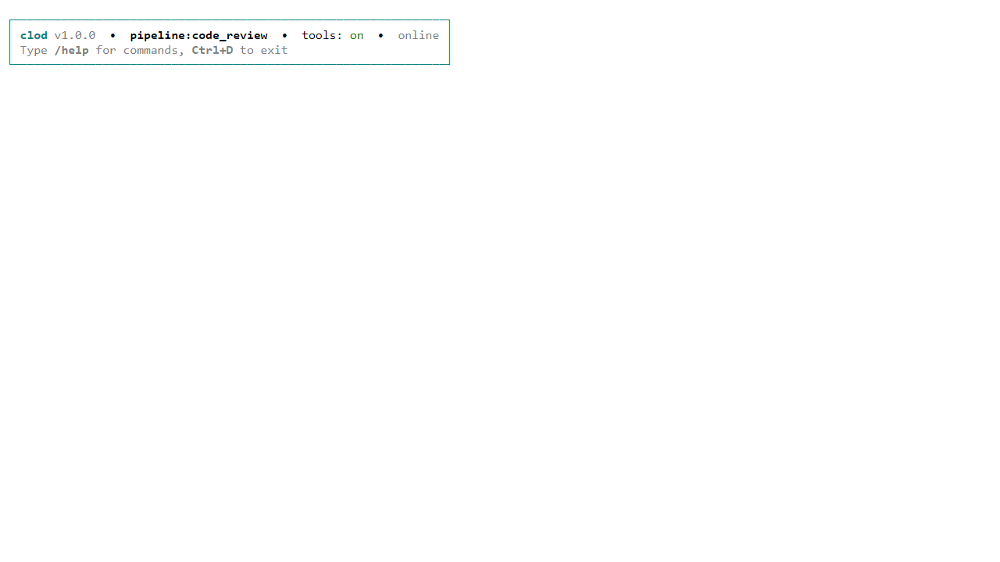
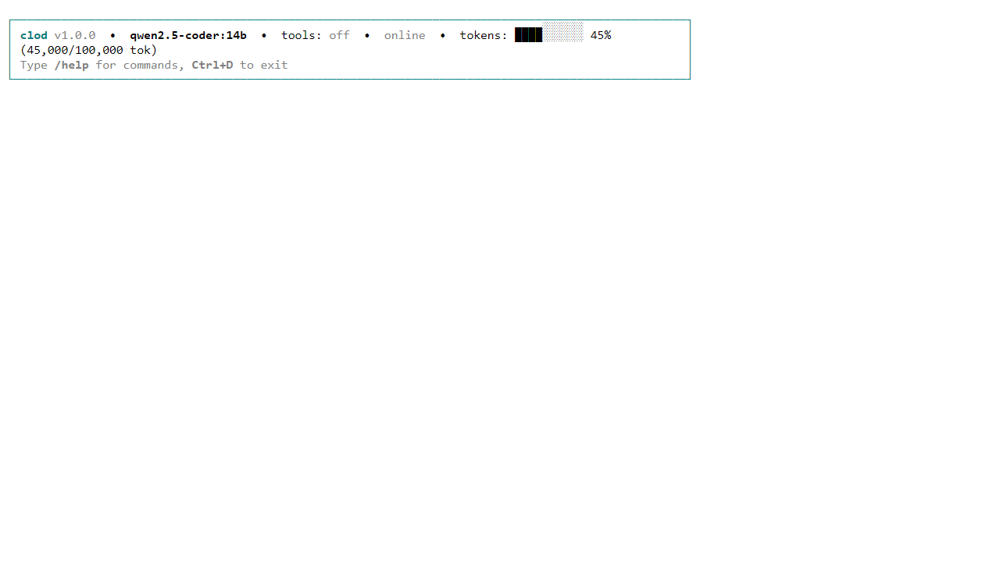
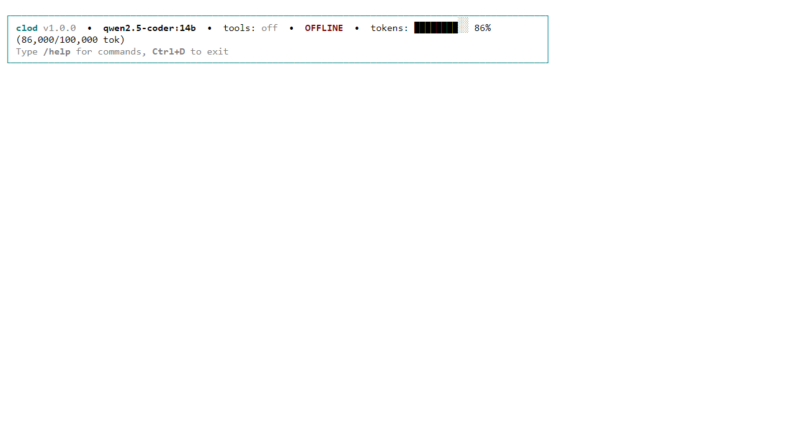

# Omni — Local AI Stack

A self-hosted, GPU-accelerated AI stack built on Docker. Local LLMs handle initial
drafts via Ollama; Claude (via LiteLLM gateway) provides final review and improvement.
All services are accessible through a single nginx reverse proxy on port 80.

---

## Prerequisites

- **Docker Desktop** (Windows) with the **WSL2 backend** enabled
- **NVIDIA Container Toolkit** — for GPU passthrough to Ollama, Stable Diffusion, TTS
- A `.env` file in this directory (copy `.env.example` or see [Environment Setup](#environment-setup))
- An **Anthropic API key** for the Claude review pipelines

---

## Quick Start

```bash
# Start the full stack
docker-compose up -d

# Stop everything (data is preserved)
docker-compose down

# Restart a single service (e.g. after editing a pipeline)
docker-compose restart pipelines

# Pull a new Ollama model
docker exec -it ollama ollama pull qwen2.5-coder:14b

# View logs for a service
docker-compose logs -f pipelines
docker-compose logs -f litellm
```

---

## Service URLs

All services are available through nginx on **port 80** (the paths below), and also
on their direct ports for cases where UI assets break at subpaths.

| Service | Nginx Path | Direct Port | Notes |
|---------|-----------|-------------|-------|
| **OpenWebUI** | `http://localhost/` | `localhost:8081` | Main chat UI — full UI at root |
| **LiteLLM** | `http://localhost/litellm/` | `localhost:4000` | LLM API gateway + budget UI |
| **Pipelines** | `http://localhost/pipelines/` | `localhost:9099` | Pipeline API |
| **Ollama** | `http://localhost/ollama/` | `localhost:11434` | Local LLM inference API |
| **ChromaDB** | `http://localhost/chroma/` | `localhost:8000` | Vector database API |
| **SearXNG** | `http://localhost/search/` | `localhost:8080` | Private meta-search |
| **n8n** | `http://localhost/n8n/` | `localhost:5678` | Automation workflows |
| **Stable Diffusion** | `http://localhost/sd/` | `localhost:7860` | Image generation |
| **Perplexica** | `http://localhost/perplexica/` | `localhost:3000` | AI-powered web search |

> **UI note:** Services at subpaths (SearXNG, n8n, SD, Perplexica) may have broken
> CSS/assets because their frontends serve static files at absolute paths. Use the
> direct port links above for the full UI experience. API endpoints always work at
> the nginx path.

---

## Pipelines (Local LLM → Claude)

Pipelines appear as selectable models in OpenWebUI. Each runs a two-stage flow:
a local Ollama model drafts a response, then Claude reviews and improves it.

Select a pipeline from the **model selector** in OpenWebUI (top of the chat window).

| Pipeline | Stage 1 (Local) | Stage 2 (Claude) | Best for |
|----------|----------------|------------------|----------|
| **OmniAI Code Review** | `qwen2.5-coder:32b` | `claude-sonnet` | Code generation, debugging, architecture |
| **OmniAI Reasoning Review** | `deepseek-r1:14b` | `claude-sonnet` | Analysis, planning, research |
| **OmniAI Chat Assist** | `llama3.1:8b` | `claude-haiku` | General Q&A, writing, conversation |
| **OmniAI Claude Review** | `qwen2.5-coder:32b` | `claude-sonnet` | Legacy pipeline — same as Code Review |

### Configuring a Pipeline

1. Go to **Admin Panel → Pipelines** in OpenWebUI
2. Click the gear icon next to a pipeline to open **Valves**
3. Adjustable settings per pipeline:
   - `LOCAL_MODEL` — which Ollama model to use for stage 1
   - `CLAUDE_MODEL` — `claude-sonnet` or `claude-opus` (via LiteLLM alias)
   - `SKIP_LOCAL` — set to `"true"` to skip local draft and call Claude directly
   - `REVIEW_SYSTEM` — customize Claude's review instructions

### GPU Note

`qwen2.5-coder:32b` requires ~20 GB VRAM. The RTX 5070 Ti has 24 GB, but Stable
Diffusion also uses the GPU. **Stop SD before using the 32b code pipeline:**

```bash
docker-compose stop stable-diffusion
# ... use Code Review pipeline ...
docker-compose start stable-diffusion
```

---

## Available Models

Models are served by Ollama and the LiteLLM gateway.

### Local (Ollama)

Pull models with `docker exec -it ollama ollama pull <model>`:

| Model | Tag | Purpose |
|-------|-----|---------|
| qwen2.5-coder | `32b-instruct-q4_K_M` | Default code pipeline (24 GB VRAM) |
| qwen2.5-coder | `14b` | Lighter code model (10 GB VRAM) |
| deepseek-r1 | `14b` | Reasoning / chain-of-thought |
| llama3.1 | `8b` | Fast conversational |
| qwen2.5vl | `7b` | Vision (image understanding) |

### Cloud (via LiteLLM — requires API keys in `.env`)

| Alias | Model | Provider |
|-------|-------|----------|
| `claude-opus` | claude-opus-4-6 | Anthropic |
| `claude-sonnet` | claude-sonnet-4-6 | Anthropic |
| `claude-haiku` | claude-haiku-4-5-20251001 | Anthropic |
| `gpt-4o` | gpt-4o | OpenAI |
| `groq-fast` | llama-3.3-70b | Groq |
| `gemini-flash` | gemini-2.0-flash | Google |

---

## clod — Local AI CLI

`clod.exe` (Windows) is a terminal CLI that talks directly to the local Omni stack.
It mirrors the Claude CLI experience but routes through Ollama and the pipelines service.

### Usage

```powershell
# Interactive REPL (default model: qwen2.5-coder:14b)
.\clod.exe

# One-shot prompt
.\clod.exe -p "explain this error: ..."

# Use a pipeline
.\clod.exe --pipeline code_review

# Enable tool use (bash, file read/write, web search)
.\clod.exe --tools

# Index a directory — generate CLAUDE.md + README.md for each project found
.\clod.exe --index C:\projects
```

### REPL Commands

| Command | Description |
|---------|-------------|
| `/model <name>` | Switch local model (triggers warmup spinner) |
| `/pipeline <name\|off>` | Switch pipeline or disable |
| `/offline [on\|off]` | Toggle offline mode — local model only, no Claude calls |
| `/tokens` | Show session Claude token usage |
| `/tools [on\|off]` | Toggle tool use |
| `/index [path]` | Index projects under path |
| `/clear` | Clear conversation history |
| `/save <file>` | Save conversation to JSON |

### Pipelines

| Pipeline | Local model | Claude model | Use for |
|----------|------------|--------------|---------|
| `code_review` | `qwen2.5-coder:32b` | `claude-sonnet` | Code gen + senior engineer review |
| `reason_review` | `deepseek-r1:14b` | `claude-sonnet` | Chain-of-thought + architect structuring |
| `chat_assist` | `llama3.1:8b` | `claude-haiku` | Conversational draft + light polish |

### Token Budget & Offline Mode

`clod` tracks cumulative Claude API tokens (input + output) per session against a
configurable budget (default: **100,000 tokens**, set `token_budget` in
`%APPDATA%\clod\config.json`).

| Usage | Behaviour |
|-------|-----------|
| ≥ 80% | Yellow warning shown after each response |
| ≥ 95% | Prompt: *"Go offline? [y/N]"* |
| 100% | Automatically switches to offline mode |

**Offline mode** disables all Claude / LiteLLM calls; every request (including
pipelines) routes to the local Ollama model. Toggle manually with `/offline`.

### Project Indexer

`--index` / `/index` walks a directory tree, detects project roots by the presence
of language markers (`.csproj`, `package.json`, `Cargo.toml`, `Dockerfile`, etc.),
and uses the **local model** to generate two files per project:

- **`CLAUDE.md`** — AI-readable context: overview, key files, build commands,
  architecture, dependencies. Claude reads this instead of ingesting raw source.
- **`README.md`** — Human-readable: description, tech stack, quick-start.

Skips `node_modules`, `.git`, `dist`, `build`, `vendor`, and other noise dirs.

### Config

`%APPDATA%\clod\config.json` (created automatically with defaults):

```json
{
  "ollama_url":    "http://localhost:11434",
  "litellm_url":   "http://localhost:4000",
  "litellm_key":   "sk-local-dev",
  "pipelines_url": "http://localhost:9099",
  "searxng_url":   "http://localhost:8080",
  "default_model": "qwen2.5-coder:14b",
  "token_budget":  100000
}
```

---

## Environment Setup

Create a `.env` file (or edit the existing one) with the following required values:

```bash
# API Keys — cloud models won't work without these
ANTHROPIC_API_KEY=sk-ant-...
OPENAI_API_KEY=sk-...        # optional
GROQ_API_KEY=gsk_...         # optional
GEMINI_API_KEY=...           # optional
TOGETHER_API_KEY=...         # optional

# LiteLLM auth key — used by pipelines and OpenWebUI
LITELLM_MASTER_KEY=sk-local-dev

# Ports (defaults shown — only set to override)
OPEN_WEBUI_PORT=8081
NGINX_ROOT_PORT=80

# Data storage root (all service data goes here)
BASE_DIR=${USERPROFILE}/docker-dependencies
```

---

## Network Architecture

```
[internet]
    ↑
  litellm:4000  (gateway network → Anthropic, OpenAI, Groq, etc.)
    ↑
[internal network — isolated]
  litellm ← pipelines → ollama:11434
                ↓
           litellm (claude-sonnet/opus review)

[default compose network]
  nginx:80 ← open-webui:8080
  nginx    ← stable-diffusion:7860

nginx also reaches internal network (dual-homed)
nginx reaches perplexica via host.docker.internal:3000
```

---

## Troubleshooting

**Pipelines not showing in OpenWebUI model selector:**
```bash
docker-compose restart pipelines
docker logs pipelines | grep -E "(Loaded|Error)"
```

**LiteLLM can't reach Ollama:**
```bash
docker exec litellm curl http://ollama:11434/api/tags
```

**Nginx 502 Bad Gateway:**
```bash
docker logs nginx
# Check if the upstream container is healthy
docker-compose ps
```

**Out of VRAM when running large models:**
```bash
# List loaded models and their VRAM usage
docker exec -it ollama ollama ps
# Unload a model
docker exec -it ollama ollama stop qwen2.5-coder:32b-instruct-q4_K_M
```

**Reset a service's data volume:**
```bash
docker-compose stop <service>
docker volume rm omni_<service>_data
docker-compose up -d <service>
```

---

## Screenshots

### Help



### Header — default


### Header — pipeline active



### Header — token budget warning (45%)



### Header — offline mode (86% used)


